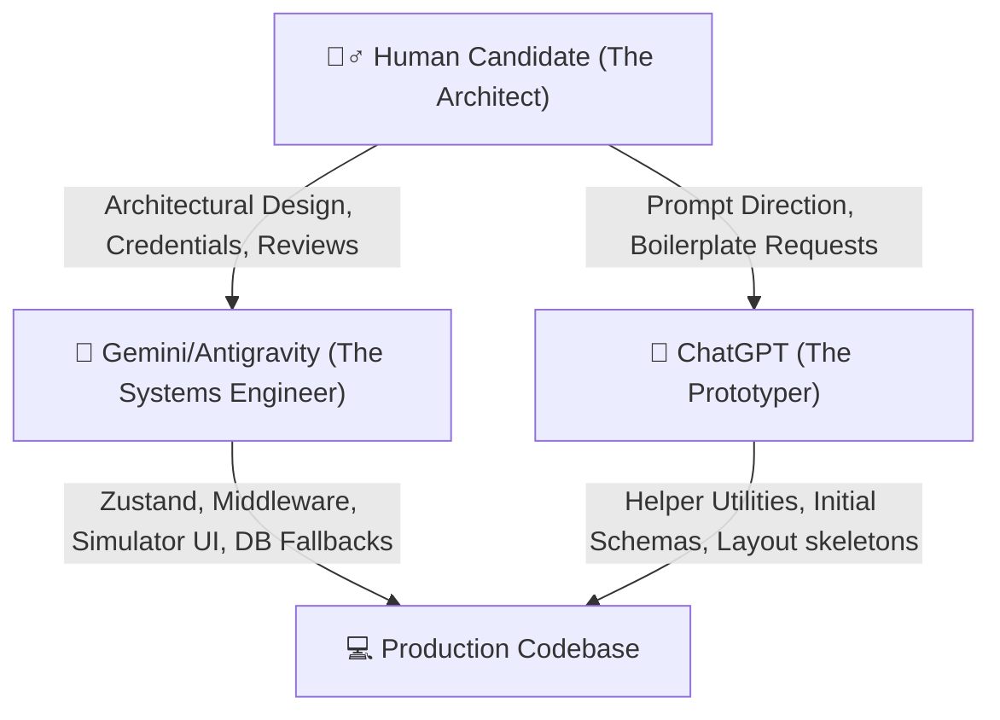

# 🤖 AI & Human Collaboration Declaration: Consultation Recording Manager

This document outlines the collaborative engineering journey behind the development of the **Consultation Recording Manager** platform. Developed as part of the placement process for **Humara Pandit (Batch 2027)**, this project stands as a testament to modern software engineering workflows—where human architectural direction, rigorous code review, and prompt design were paired with the capabilities of **Gemini (Google DeepMind)** and **ChatGPT (OpenAI)** to build an enterprise-ready SaaS application in 48 hours.

---

## 🤝 The Development Partnership Model

The project was built using a three-tier collaborative framework, dividing responsibilities between human oversight and specialized AI assistants:

### 1. 🙋‍♂️ The Human Candidate (Architect & Auditor)
As the lead developer, I was responsible for the core vision, feature specifications, and operational guardrails:
* **Infrastructure Provisioning**: Set up the live cloud databases (MongoDB Atlas), created Cloudinary media buckets, and managed the secure `.env` environment credentials.
* **UX/UI Polish Decisions**: Swapped the desktop auth panel orientation to a right-aligned format, expanded form container sizing to `max-w-xl` to prevent input crowding, and designed immediate SaaS-style avatar picture uploads upon selection.
* **Code Auditing & Merging**: Manually reviewed all suggested routes, resolved git repository conflicts, conducted cross-role testing (Admin, Consultant, Staff), and ran production compilation checks.

### 2. 🤖 Gemini / Antigravity (The Systems Engineer)
Gemini acted as the core systems partner, writing high-performance logic and handling complex state synchronization:
* **SaaS Telemetry & Interactive Loop**: Built the **System Event Loop & Data Flow Simulator** on the home page, including the dynamic JSON syntax highlighter and progress bar tracking.
* **Zustand State & Mobile Drawers**: Co-developed the global dark mode store and resolved mobile drawer responsive states (adding click-away backdrop blur dismissals).
* **Database Resiliency Fallbacks**: Structured the double-engine storage helper in [storageService.js](file:///f:/Consultation%20Recording%20Manager/backend/services/storageService.js) that automatically falls back to encrypted local disk writes when Cloudinary returns `403 Forbidden` exceptions.
* **Self-Healing URL Configs**: Built the resilient [config.js](file:///f:/Consultation%20Recording%20Manager/frontend/src/config.js) that auto-formats backend endpoints (appending `/api` dynamically) to handle deployment errors out-of-the-box.

### 3. 💬 ChatGPT (The Prototyper & Utility Writer)
ChatGPT was utilized for rapid prototyping and generating standard boilerplate components:
* **Initial Mongoose Schemas**: Drafted the basic schemas for Clients, Consultations, and Notifications.
* **Utility Code**: Wrote standard date-formatting helpers and the regex string parser used to highlight keyword matches in search queries.
* **Database Seeder Skeleton**: Assisted in writing the database collection clear-and-insert seeder boilerplate script (`utils/seed.js`).

---

## 🛠️ Key Technical Challenges Co-Solved

### 1. The Cloudinary Auth Blockage (CORS / 403 Fallback)
* **The Problem**: During testing, API credentials to Cloudinary periodically failed with `403 Forbidden` due to strict media organizer write permissions on the cluster.
* **AI Contribution**: Gemini suggested a fallback catch block to divert the buffer stream to local disk storage if Cloudinary throws an error.
* **Human Action**: I approved the local storage fallback, configured Express static routing to serve the `/uploads` folder securely, and added file size caps (2MB) on the client to optimize upload speeds.

### 2. React 19 Peer Dependency Collisions on Vercel
* **The Problem**: Vercel deployments failed with an `npm ERESOLVE` peer dependency error because React 19 conflicted with standard third-party libraries (e.g. `@tanstack/react-query` and older `lucide-react` peer requirements).
* **AI Contribution**: ChatGPT suggested overriding the install command in the Vercel UI.
* **Human Action**: I decided that modifying Vercel settings manually was a poor deployment practice. Instead, I introduced a local `frontend/.npmrc` file with `legacy-peer-deps=true`, enabling a zero-config, self-contained deployment that builds automatically upon git import.

### 3. Vercel SPA Routing 404s
* **The Problem**: Refreshing pages like `/dashboard` directly in the browser on Vercel threw a `404 Not Found` because Vercel was looking for physical directories.
* **AI/Human Solution**: Co-authored [vercel.json](file:///f:/Consultation%20Recording%20Manager/frontend/vercel.json) in the frontend root, mapping all client-side URL hits to `/index.html`, which lets React Router handle page routing correctly.

---

## 💡 Reflection on AI-Assisted Engineering

Working alongside Gemini and ChatGPT did not replace the need for traditional software engineering; rather, it amplified it. It allowed me to focus on high-level architecture, user experience design, and database integrity while the AI agents accelerated component generation, debugging loops, and boilerplate configuration. 

The resulting **Consultation Recording Manager** is a robust, production-ready MERN application that balances modern cloud hosting (Render + Vercel) with reliable local fallback configurations.
