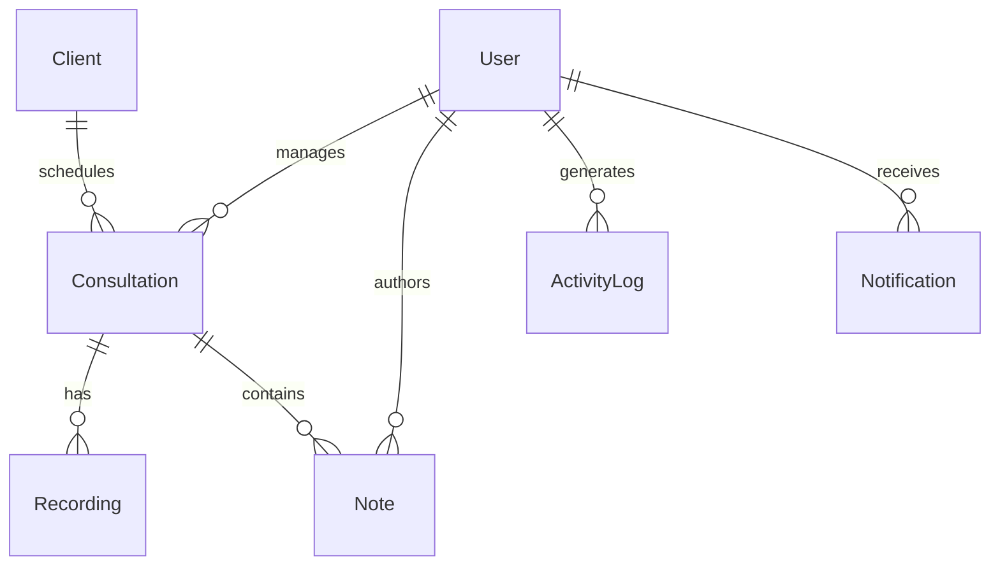

Live Link :- https://consultation-recording-manager.vercel.app/

# Consultation Recording Manager (MERN Stack)

A secure, enterprise-grade SaaS-style platform built for managing, transcribing, and auditing consultation recordings. The application implements role-based access control (RBAC), simulated AI-powered transcription/summarization pipelines, Recharts analytics, and Cloudinary media cloud hosting with graceful local fallback channels.

## 🚀 Tech Stack

- **Frontend**: React (Vite), Tailwind CSS, Zustand (state persistence), Axios, React Query, Recharts, Lucide Icons
- **Backend**: Node.js, Express.js, Multer
- **Database**: MongoDB, Mongoose (indexing & text searching models)
- **Storage**: Cloudinary API (Graceful local filesystem fallback if credentials omitted)
- **Security**: JWT Authentication (attached via Axios Interceptors), bcrypt password hashing, Helmet headers, CORS filters

---

## 🔑 Default Roles & Seed Credentials

The database comes pre-seeded with active credentials. Run `npm run seed` in `/backend` to reset the database and seed these accounts:

| Role | Email | Password | Allowed Scope |
| :--- | :--- | :--- | :--- |
| **Admin** | `admin@crm.com` | `password123` | Full user administration, full system logs, CRUD everything, delete files. |
| **Consultant** | `consultant@crm.com` | `password123` | View assigned consultations, play recordings, write rich-text session notes. |
| **Staff** | `staff@crm.com` | `password123` | Manage client registries, schedule consultation slots, upload audio/video. |

---

## 🛠️ Installation & Setup

### Prerequisites
- Node.js (v18+)
- MongoDB running locally or a MongoDB Atlas URI connection

### 1. Backend Configuration
1. Navigate to the backend directory:
   ```bash
   cd backend
   ```
2. Setup environment variables by copying `.env.example` to `.env`:
   ```bash
   cp .env.example .env
   ```
3. Populate variables inside `.env`:
   ```env
   PORT=5000
   MONGODB_URI=mongodb://127.0.0.1:27017/consultation-manager
   JWT_SECRET=supersecuresecretkeyshouldbechangedinproduction123456
   JWT_EXPIRE=7d

   # Cloudinary Keys (If omitted, system uses local uploads directory)
   CLOUDINARY_CLOUD_NAME=your_cloudinary_cloud_name
   CLOUDINARY_API_KEY=your_cloudinary_api_key
   CLOUDINARY_API_SECRET=your_cloudinary_api_secret
   ```
4. Install dependencies:
   ```bash
   npm install
   ```
5. Seed database collections:
   ```bash
   npm run seed
   ```
6. Start the Express server:
   ```bash
   npm run dev
   ```

### 2. Frontend Configuration
1. Navigate to the frontend directory:
   ```bash
   cd ../frontend
   ```
2. Install dependencies (React 19 resolution):
   ```bash
   npm install --legacy-peer-deps
   ```
3. Start the Vite development hot-reloading server:
   ```bash
   npm run dev
   ```
4. Access the web panel at `http://localhost:5173/`.

---

## 📊 Database Collections & Relations



- **Users**: Admin, Consultant, and Staff accounts.
- **Clients**: Client details (Name, Email, Phone, Address).
- **Consultations**: Appointment slots (Client ref, Consultant ref, Duration, Status, Tags).
- **Recordings**: Metadata and transcripts (Consultation ref, URL, duration, text transcripts, AI summaries, bullet action-items, and text indices for smart searches).
- **Notes**: Custom rich text records (Consultation ref, Author ref, HTML string content).
- **Notifications**: System warnings and uploads tracking.
- **ActivityLogs**: System audits containing event types, user details, and client IP addresses.

---

## 🌐 API Route Map Reference

All endpoints below (excluding auth register/login) require a `Authorization: Bearer <JWT_TOKEN>` header.

### 🔑 Authentication Module
- `POST /api/auth/register` - Create user (forces Staff unless first system user)
- `POST /api/auth/login` - Authenticate credentials and return JWT
- `GET /api/auth/me` - Fetch profile metadata
- `POST /api/auth/forgotpassword` - Request recovery token (Console printed)
- `PUT /api/auth/resetpassword/:resettoken` - Reset password via token
- `PUT /api/auth/changepassword` - Update account password

### 👥 Client Management
- `GET /api/clients` - List paginated clients (supports `?search=`)
- `GET /api/clients/:id` - Client detail card
- `POST /api/clients` - Register client (Admin, Staff only)
- `PUT /api/clients/:id` - Update client (Admin, Staff only)
- `DELETE /api/clients/:id` - Cascade delete client (Admin only)

### 📅 Consultation Management
- `GET /api/consultations` - Search and list appointments (Role filtered)
- `GET /api/consultations/:id` - Detailed notes and media overview
- `POST /api/consultations` - Schedule slot (Admin, Staff only)
- `PUT /api/consultations/:id` - Reschedule slot (Admin, Staff, assigned Consultant)
- `DELETE /api/consultations/:id` - Cascade delete consultation (Admin only)

### 🎙️ Recordings Management
- `GET /api/recordings` - Search within transcripts/titles (Role filtered)
- `GET /api/recordings/:id` - Fetch transcript details and AI summaries
- `POST /api/recordings` - Upload and process audio files (Admin, Staff only)
- `DELETE /api/recordings/:id` - Delete recording database and Cloud files (Admin only)

### 📝 Notes & Notifications
- `GET /api/notes/consultation/:consultationId` - Load notes feed
- `POST /api/notes` - Add Note with HTML format support
- `PUT /api/notes/:id` - Edit note (Author/Admin only)
- `DELETE /api/notes/:id` - Remove note (Author/Admin only)
- `GET /api/notifications` - Fetch notification inbox
- `PUT /api/notifications/:id/read` - Toggle read status

### 📈 Reports & Admin
- `GET /api/analytics/dashboard` - Quick counters, capacity, trend lines
- `GET /api/analytics/reports` - Detailed bar and pie charts aggregates
- `GET /api/admin/users` - User permissions control table (Admin only)
- `PUT /api/admin/users/:id` - Demote/promote user (Admin only)
- `GET /api/admin/logs` - Paginated activity audit trail (Admin only)
- `GET /api/admin/settings` - System settings profile (Admin only)
- `PUT /api/admin/settings` - Modify system configs (Admin only)

---

## ☁️ Production Deployment Guide

### MongoDB Atlas Setup
1. Create a free cluster on [MongoDB Atlas](https://www.mongodb.com/cloud/atlas).
2. Under Network Access, add IP `0.0.0.0/0` (or your platform's specific CIDR block).
3. Create a Database User and copy the connection string. Replace the `MONGODB_URI` environment variable in production with this connection string.

### Cloudinary Storage Setup
1. Register a free account at [Cloudinary](https://cloudinary.com).
2. Retrieve your `Cloud Name`, `API Key`, and `API Secret` from your console dashboard.
3. Add these variables to your production environment. The application will automatically detect them and switch file uploads from local fallback to cloud storage instantly.

### Deploying to Render / Heroku
#### A. Backend Deployment
- Set Build Command to: `npm install`
- Set Start Command to: `npm start`
- Inject all `.env` environment variables into the platform dashboard settings.

#### B. Frontend Deployment (Vite)
- Set Build Command to: `npm run build`
- Set Publish Directory to: `dist/`
- For single-page routing (SPA), add a redirects file or server configuration mapping all requests to `index.html` to prevent route refreshes throwing 404 errors.
